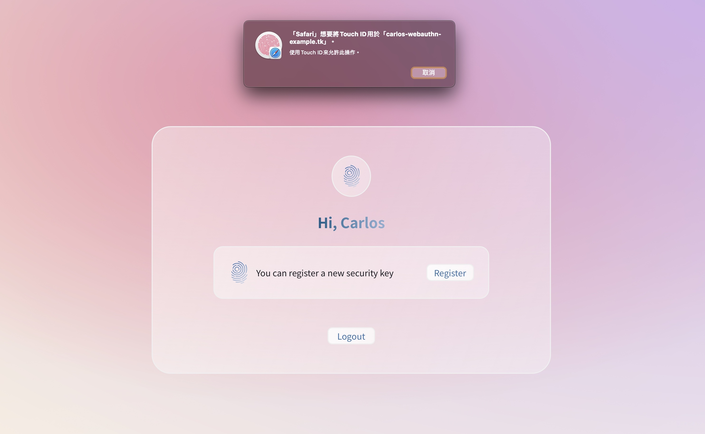

<!-- Title & Logo -->
<h1 align="center">Webauthn API</h1>

<!-- tag & links (Version\Lang\Package) -->
<p align="center">
    
    
    
    
    
    
    
    
    
</p>
<p align="center">
    Source：<a href="https://github.com/evilz0212/ex-fe-webauthn">Github [F-E]</a>、<a href="https://github.com/evilz0212/ex-be-webauthn">Github [B-E]</a> ｜ 
	Demo：<a href="https://carlos-webauthn-example.tk/">GCP server</a> ｜ 
	Design：<a href="https://www.figma.com/file/VT83sXiCd5nfAFzSC13T28/ex-be-webauthn?node-id=1%3A3">Figma</a>
<p>

<!-- Overview (Preview\Purpose\Description) -->


# Overview
> 使用雙重因素登入（密碼+生物辨識）

### Target
1. Docker 快速部署前後端專案
   - Dockerfile\docker-compose 映像檔設定
   - nginx-proxy 反向代理後端 api
2. GCP 架設雲端主機
   - SSH 金鑰連線
   - Domain 自訂網域申請
   - SSL 憑證申請
   - clamav 定期防毒掃描
   - 資安設定（防火牆設定、TLS 版本、限制同源iFrame）
3. UI 設計
   - Flowchart\Wireframe 流程\版型\組件規劃
   - Mockup 玻璃擬真風格設計
4. Vue 前端專案建構
   - scss 樣式組件化
   - js services 功能封裝
   - api 管理

### Detail
-  雲端主機：
   -  Server：GCP, Cloud DNS, VM(ubuntu 18.04)
   -  Domain：freenom
   -  SSL：sslforfree
   -  App：docker, docker-compose, nginx, clamav
-  前端框架：Vue(3.0), Vuex, Vue-Router
-  編譯工具：Vite
-  模板語言：ES6, SASS, Pug
-  應用套件：
   -  vuex-persistedstate：Store 狀態保存
   -  Axios：攔截器、統一錯誤管理、封裝請求


<!-- Get started (Install\Step) -->
# Get started
### Step.1 建立後端 api
1. Install docker & docker-compose
2. Build backend project：[ex-be-webauthn](https://github.com/evilz0212/ex-be-webauthn)

### Step.2 建立前端專案
1. git clone
2. Copy .crt & .key to ```docker/nginx/ssl/``` & ```docker/nginx-proxy/ssl/```
3. Create Images
```
npm run docker-up
cd docker/nginx-proxy/ && npm run up
```

### Step.3 開啟測試頁
1. 修改本機 host ```127.0.0.1 carlos-webauthn-example.tk```
2. Demo page：https://carlos-webauthn-example.tk/


# APIs
### JWT Login
POST ```/api/auth/register```：Register a new member

POST ```/api/auth/login```：Member login

GET ```/api/auth/getUser```：Update member information

### Webauthn
GET ```/api/webauthn/register```：Get datas to register a new key

POST ```/api/webauthn/register```：Post datas after a WebAuthn register check

GET ```/api/webauthn/auth```：Get datas to login

POST ```/api/webauthn/auth```：Post datas after a WebAuthn login validate

DELETE ```/api/webauthn/${key}```：Delete registered key
<!-- Partner -->

<!-- License -->